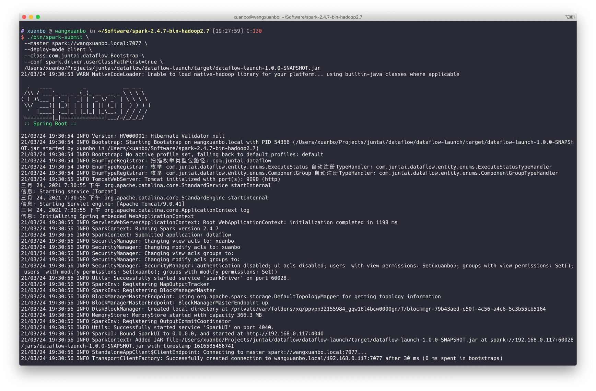

# dataflow

> 基于 Spark 任务流执行平台

## 依赖

- Scala 2.11.12
- Spark 2.4.7
- Spring Boot 2.3.7.RELEASE

## 模块介绍

```text
├── dataflow-core        核心模块
├── dataflow-launch      启动		
├── dataflow-plugin      插件（组件）
```

## 快速开始

- 修改 src/main/resources/application.yaml 配置文件

  ```yaml
  spring:
    datasource:
      driver-class-name: com.mysql.cj.jdbc.Driver
      url: jdbc:mysql://localhost:3306/dataflow?serverTimezone=Asia/Shanghai&useUnicode=true&characterEncoding=utf8
      username: root
      password: 123456
  ```

- 启动 src/main/resources/tk.fishfish.dataflow.Bootstrap 程序

- 部署（内嵌 Spark 服务，对于集群部署见集群说明）

  打包（指定 dev 环境，会将 Spark 依赖打入 jar 包）：

  ```shell
  mvn clean package -Pdev -DskipTests
  ```

  运行：

  ```shell
  java -jar /some/path/dataflow-launch-1.0.0-SNAPSHOT.jar
  ```


## 组件

组件定义如下：

```json5
{
  "id": "组件ID",
  "name": "组件类型",
  "text": "描述",
  "argument": {
    // 输入
    "input": {
    },
    // 输出
    "output": {
    }
  }
}
```

- [组件介绍文档](./component.md)
- [插件开发指北](./plugin.md)

## DAG

将任务绘制成流程图，利用 DAG 算法进行节点运算。

```text
POST http://127.0.0.1:9090/v1/dag/run
```

```json5
{
  // 执行ID
  "executionId": "1",
  // 上下文
  "context": {},
  // DAG流程图
  "graph": {
    "nodes": [
      {
        "id": "1",
        "name": "SOURCE_SQL",
        "text": "读",
        "argument": {
          "input": {
            "url": "jdbc:iotdb://127.0.0.1:6667/",
            "user": "root",
            "password": "root",
            "sql": "select * from root.demo"
          },
          "output": {
            "table": "demo1"
          }
        }
      },
      {
        "id": "2",
        "name": "TRANSFORMER_SQL",
        "text": "转换",
        "argument": {
          "input": {
            "table": "demo1",
            "select": "Time AS time, `root.demo.temperature` AS temperature, `root.demo.hardware` AS hardware"
          },
          "output": {
            "table": "demo2"
          }
        }
      },
      {
        "id": "3",
        "name": "TRANSFORMER_SQL_CONTEXT",
        "text": "上下文",
        "argument": {
          "input": {
            "table": "demo2",
            "contexts": [
              {
                "name": "executionId",
                "alias": "_executionId"
              }
            ]
          },
          "output": {
            "table": "demo3"
          }
        }
      },
      {
        "id": "4",
        "name": "TARGET_LOG",
        "text": "写",
        "argument": {
          "input": {
            "table": "demo3"
          },
          "output": {}
        }
      }
    ],
    "edges": [
      {
        "from": "1",
        "to": "2"
      },
      {
        "from": "2",
        "to": "3"
      },
      {
        "from": "3",
        "to": "4"
      }
    ]
  }
}
```

## 集群



默认情况下，Profile dev 为开发测试环境。通过 prod 开启集群环境支持。

打包：

```shell
mvn clean package -Pprod -DskipTests
```

此时，jar 中不包含 spark 相关的依赖，我们通过 spark-submit 将程序部署到集群（standalone）：

```shell
./bin/spark-submit \
 --master spark://spark-master:7077 \
 --deploy-mode client \
 --class tk.fishfish.dataflow.Bootstrap \
 --conf spark.driver.userClassPathFirst=true \
 /some/path/dataflow-launch-1.0.0-SNAPSHOT.jar
```

对于 yarn 环境则将 master 修改为 yarn 即可。

注意：deploy-mode 为 client 是为了固定 driver 端，方便作为 API 服务访问。
