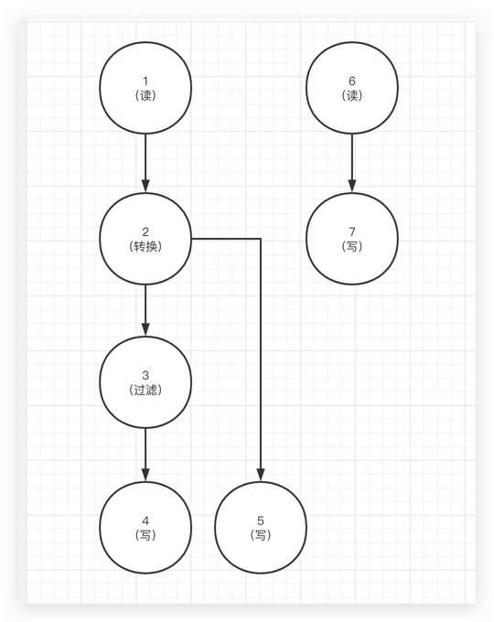

# dataflow

> 基于 Spark 任务流执行平台

## 依赖

- Scala 2.11.12
- Spark 2.4.7
- Spring Boot 2.3.7.RELEASE

## 文档

待完善

## API

待完善

### 提交任务

> 不支持多节点合并



```text
POST /v1/dag/run

{
    "nodes":[
        {
            "id":"1",
            "name":"读",
            "nodeType":"SQL_SOURCE",
            "conf":{
                "jdbc": {
                    "driver": "com.mysql.cj.jdbc.Driver",
                    "url": "jdbc:mysql://127.0.0.1:3306/dataflow?useUnicode=true&characterEncoding=UTF-8",
                    "user": "root",
                    "password": "123456",
                    "table": "test"
                },
                "columns":[
                    {
                        "name":"id",
                        "type":"INT"
                    },
                    {
                        "name":"name",
                        "type":"STRING"
                    },
                    {
                        "name":"age",
                        "type":"INT"
                    }
                ]
            }
        },
        {
            "id":"2",
            "name":"转换",
            "nodeType":"DEFAULT_TRANSFORMER",
            "conf":{
                "columns":[
                    {
                        "name":"id",
                        "type":"INT",
                        "transforms":[
                        ]
                    },
                    {
                        "name":"name",
                        "type":"STRING",
                        "transforms":[
                            {
                                "type":"RENAME",
                                "value":"name1"
                            }
                        ]
                    },
                    {
                        "name":"age",
                        "type":"INT",
                        "transforms":[
                            {
                                "type":"RENAME",
                                "value":"age1"
                            }
                        ]
                    }
                ]
            }
        },
        {
            "id":"6",
            "name":"读",
            "nodeType":"SQL_SOURCE",
            "conf":{
                "jdbc": {
                    "driver": "com.mysql.cj.jdbc.Driver",
                    "url": "jdbc:mysql://127.0.0.1:3306/dataflow?useUnicode=true&characterEncoding=UTF-8",
                    "user": "root",
                    "password": "123456",
                    "table": "test"
                },
                "columns":[
                    {
                        "name":"id",
                        "type":"INT"
                    },
                    {
                        "name":"name",
                        "type":"STRING"
                    },
                    {
                        "name":"age",
                        "type":"INT"
                    }
                ]
            }
        },
        {
            "id":"3",
            "name":"过滤",
            "nodeType":"SQL_FILTER",
            "conf":{
                "conditions":[
                    "age1 >= 25"
                ],
                "columns":[
                    {
                        "name":"id",
                        "type":"INT"
                    },
                    {
                        "name":"name1",
                        "type":"STRING"
                    },
                    {
                        "name":"age1",
                        "type":"INT"
                    }
                ]
            }
        },
        {
            "id":"4",
            "name":"写",
            "nodeType":"SQL_TARGET",
            "conf":{
                "jdbc": {
                    "driver": "com.mysql.cj.jdbc.Driver",
                    "url": "jdbc:mysql://127.0.0.1:3306/dataflow?useUnicode=true&characterEncoding=UTF-8",
                    "user": "root",
                    "password": "123456",
                    "table": "test1"
                },
                "columns":[
                    {
                        "name":"id",
                        "type":"INT"
                    },
                    {
                        "name":"name1",
                        "type":"STRING"
                    },
                    {
                        "name":"age1",
                        "type":"INT"
                    }
                ]
            }
        },
        {
            "id":"5",
            "name":"写",
            "nodeType":"LOG_TARGET",
            "conf":{}
        },
        {
            "id":"7",
            "name":"写",
            "nodeType":"LOG_TARGET",
            "conf":{}
        }
    ],
    "edges":[
        {
            "from":"1",
            "to":"2"
        },
        {
            "from":"2",
            "to":"5"
        },
        {
            "from":"2",
            "to":"3"
        },
        {
            "from":"3",
            "to":"4"
        },
        {
            "from":"6",
            "to":"7"
        }
    ]
}
```

如上的配置拆分 3 个任务提交到 Spark 运行：

- 1 -> 2 -> 5
- 1 -> 2 -> 3 -> 4
- 6 -> 7

并会在运行时缓存节点：

- 1
- 2

暂未做到更智能的只缓存节点：2
