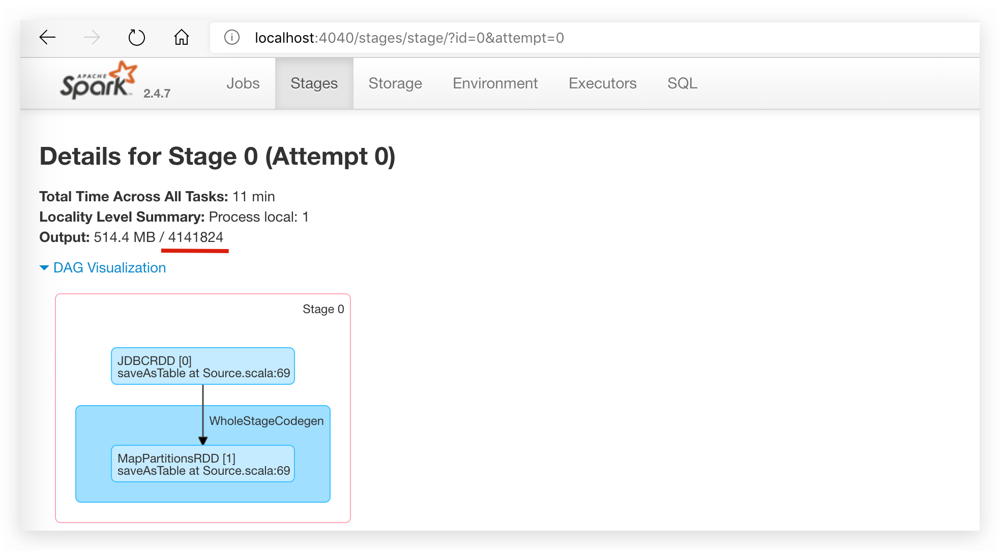

# dataflow

> 基于 Spark 任务流执行平台

## 设计

### 概念

dataflow 中的概念：

- executionId

  每次将 dag 任务提交到 dataflow 时会生成唯一执行 id

- taskId

  在一次 dag 执行中，dag 中的每个 node 执行时都会生成唯一任务 id

---

spark 中的概念：

- job

  spark 每次遇到 action 算子会提交一个 job

- stage

  spark 将 job 划分为多个 stages 执行（每次遇到 shuffle 都会划分一个 stage）

- task

  stage 下的一个执行单元，每个 task 只处理一个 partition 上的数据

--- 

需要注意的是，dataflow 中的一个 task 会生成 spark 的一（多）个 job 去完成一个组件的操作。

### 组件介绍

### 组件

组件定义如下：

```json5
{
  "id": "组件ID",
  "name": "组件类型",
  "text": "描述",
  "argument": {
    // 输入
    "input": {
    },
    // 输出
    "output": {
    }
  }
}
```

[组件介绍](./component-introduction.md)

## 依赖

- Scala 2.11.12
- Spark 2.4.7
- Spring Boot 2.3.7.RELEASE

## 模块介绍

```text
├── dataflow-core        引擎
├── dataflow-udf         Spark SQL自定义函数
├── dataflow-sdk         SDK集成
├── dataflow-launch      引擎启动
```

## 快速开始（嵌入式）

### 配置

修改 src/main/resources/application.yaml 配置文件

```yaml
spring:
  datasource:
    driver-class-name: com.mysql.cj.jdbc.Driver
    url: jdbc:mysql://127.0.0.1:3306/dataflow?serverTimezone=Asia/Shanghai&useUnicode=true&characterEncoding=utf8
    username: root
    password: 123456
```

### 本地启动

- 启动 src/main/resources/k.fishfish.dataflow.Bootstrap 程序

### 部署

打包（指定 embed 环境，会将 Spark 依赖打入 jar 包）：

```shell
mvn clean package -Pembed -DskipTests
```

运行：

```shell
java -jar /some/path/dataflow-launch-1.0.0-SNAPSHOT.jar
```

### 计算

将任务绘制成流程图，利用 DAG 算法进行节点运算。

例如，如下将 test_user 表数据同步到 test_user_copy1 表中

```curl
curl --location --request POST 'http://127.0.0.1:9090/v1/dag/run' \
--header 'Content-Type: application/json' \
--data-raw '{
    "executionId": "1",
    "context": {},
    "graph": {
        "nodes": [
            {
                "id": "1",
                "name": "DATABASE_SOURCE",
                "text": "读",
                "argument": {
                    "input": {
                        "url": "jdbc:mysql://127.0.0.1:3306/test?serverTimezone=Asia/Shanghai&useUnicode=true&characterEncoding=utf8",
                        "user": "root",
                        "password": "123456",
                        "sql": "select * from test_user"
                    },
                    "output": {
                        "table": "t1"
                    }
                }
            },
            {
                "id": "2",
                "name": "SQL_TRANSFORMER",
                "text": "转换",
                "argument": {
                    "input": {
                        "sql": "select * from {namespace}.t1"
                    },
                    "output": {
                        "table": "t2"
                    }
                }
            },
            {
                "id": "3",
                "name": "DATABASE_SINK",
                "text": "写",
                "argument": {
                    "input": {
                        "table": "t2"
                    },
                    "output": {
                        "url": "jdbc:mysql://127.0.0.1:3306/test?serverTimezone=Asia/Shanghai&useUnicode=true&characterEncoding=utf8",
                        "user": "root",
                        "password": "123456",
                        "table": "test_user_copy",
                        "mode": "update"
                    }
                }
            }
        ],
        "edges": [
            {
                "from": "1",
                "to": "2"
            },
            {
                "from": "2",
                "to": "3"
            }
        ]
    },
    "callback": "http://127.0.0.1:8080/callback"
}'
```

## 性能

### MySQL

#### MySQL读

1. 底层使用流式查询，防止数据全部查询到客户端导致OOM
1. 支持切片加载（分区字段需要是数值类型），并发抽数，提升性能

具体表现，410w数据量11分钟读取完毕，约6000/s的读取性能（测试环境测试结果，依赖具体机器性能），整个过程中内存占用平稳



#### MySQL写

1. 底层使用批量写入
1. 支持数据分区后，并发写入

具体表现，410w数据量6分钟半写入完毕，约10000/s的写入性能（本地测试结果，依赖具体机器性能），整个过程中内存占用平稳


